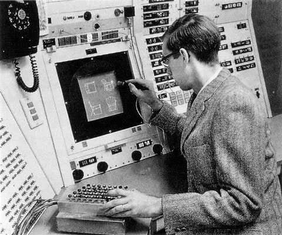
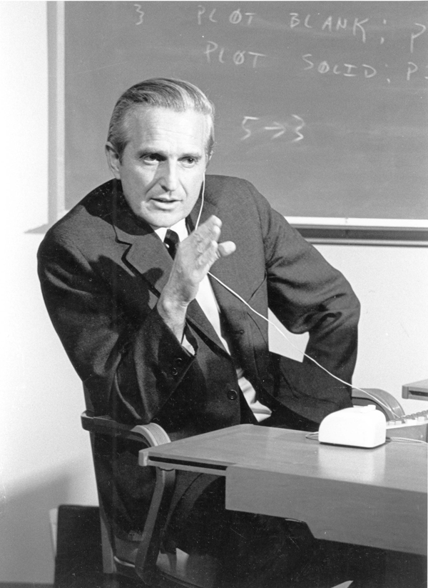
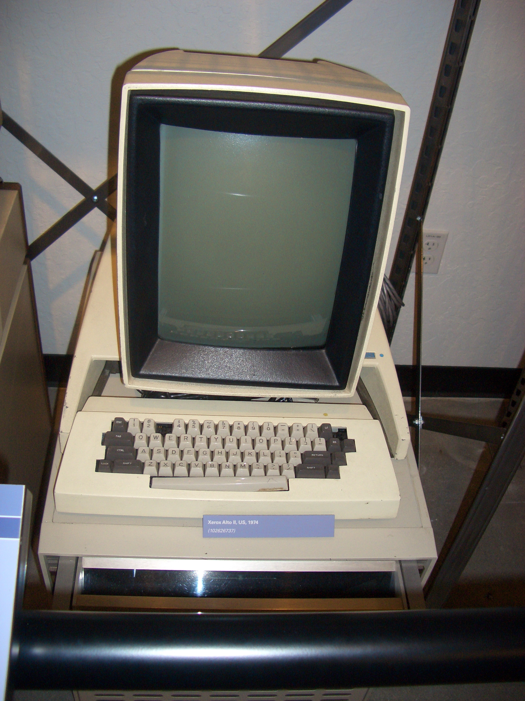
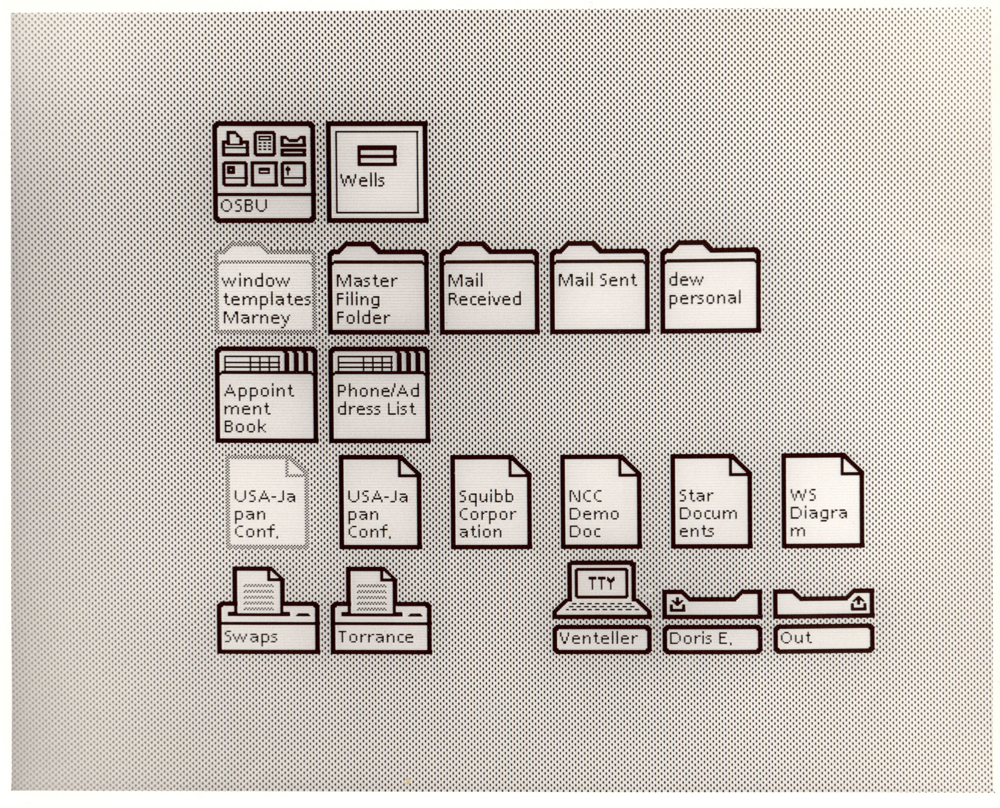
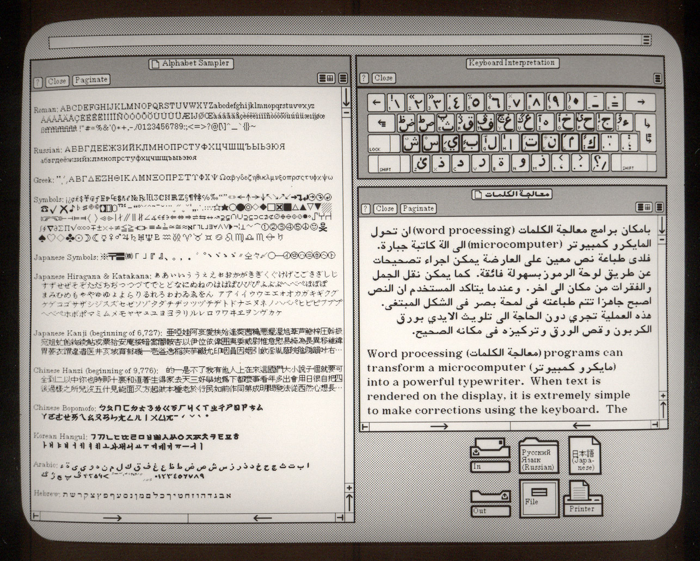
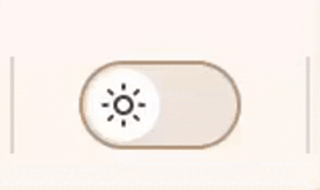

## 简述

在现在这个生成式语言大模型（LLM）**遍布全世界**的时代，几乎每一个行业，在UI（软件操作页面）设计行业AI（LLM）也**贡献了很不错的效率！**

所以在这个情况下大家在做软件的时候**也开始慢慢变得很注意UI（软件操作页面）是否好看操作起来是否方便**，因为用AI做一个软件似乎**太快了**，所以就需要**在创新和美学上下功夫！**

但是因为现代的软件UI（软件操作页面）并不是**凭空想出来**的而是根据早期工业机器的**实体按钮软件化**做出来的后面慢慢形成**一套设计理念和习惯**随着电子设备的普及传向更多人。

因为其操作方式很**过于程序化设计化**，所以软件也许做的**很方便很好看**但是使用者可能**并不是**程序员、设计师；也许**只是**一个普普通通的画家、作家、音乐家、心理学家等。

TA们在使用软件的时候，或许会因为找一个按钮**找半天而大大影响使用体验**导致慢慢产生了**抵制**更先进软件的行为。

所以本篇文章想讨论的是**面向普通用户群体**的软件应该如何设计，应该怎么**打破**之前那套持续了将近40年的UI（操作页面）设计理念，做出**更适合**普通用户的UI（操作页面）。

:::warning
专业软件因为本就需要较程序化的生产方式所以本篇文章提出的所有概念和设计方向等都不适用于专业软件！
:::

## 软件UI（操作页面）的起源

如果我们想理解今天的软件 UI 为什么会变得越来越复杂，也许首先需要回到一个更基本的问题：

> **软件 UI 最初究竟是怎么出现的？**

今天我们习以为常的窗口、图标、菜单、按钮和鼠标，并不是一开始就存在的。它们经历了几十年的计算机发展，才逐渐形成了我们今天熟悉的图形用户界面（GUI）。

---

### 1. 在 GUI 出现之前：人通过命令使用计算机

早期计算机主要通过穿孔卡片、纸带、控制面板以及后来出现的文本终端与计算机交互。

在这种模式下，计算机更像是一台需要被“操作”的机器：

> 人告诉计算机应该执行什么命令，计算机执行命令并返回结果。

用户必须理解计算机能够接受什么样的指令。

这种交互方式对于专业人员来说效率很高，但对于普通人而言，最大的障碍就是：

> **你必须先学会计算机的语言。**

因此，早期人机交互研究开始尝试寻找一种更加直接的方式，让人能够通过视觉和动作与计算机中的内容进行交互。

---

### 2. 1963 年：Sketchpad

1963 年，Ivan Sutherland 开发了 **Sketchpad**。

它被认为是早期图形用户界面的重要先驱之一。

Sketchpad 使用光笔作为输入设备，用户可以直接在屏幕上绘制、选择和修改图形对象。



> 图片来源：Ivan Sutherland 与 Sketchpad（1962，MIT Lincoln Laboratory），出自 [Computer History Museum](https://www.computerhistory.org/revolution/computer-graphics-music-and-art/15/209/1878)

这与传统的命令输入存在明显区别：

```text
传统方式：

告诉计算机：
“画一条线”

↓
计算机执行
```

而 Sketchpad 更接近：

```text
看到屏幕上的对象

↓
直接操作对象
```

这意味着人与计算机之间开始出现了一种新的关系：

> **用户不再只是向计算机发送命令，而是可以直接操纵计算机屏幕上的对象。**

Sketchpad 后来的许多思想都成为图形交互发展的重要基础。

图片资料：

* [https://commons.wikimedia.org/wiki/Category:Sketchpad](https://commons.wikimedia.org/wiki/Category:Sketchpad)
* [https://commons.wikimedia.org/wiki/File:SketchpadDissertation-Fig4-2.tif](https://commons.wikimedia.org/wiki/File:SketchpadDissertation-Fig4-2.tif)
* [https://www.computerhistory.org/revolution/computer-graphics-music-and-art/15/209/1878](https://www.computerhistory.org/revolution/computer-graphics-music-and-art/15/209/1878)

---

### 3. 1968 年：鼠标和“直接操作”

到了 1960 年代，Douglas Engelbart 及其团队在 Stanford Research Institute（SRI）继续研究人与计算机之间更加直接的交互方式。

他们开发了 **NLS（oN-Line System）**。

NLS 使用了鼠标、屏幕上的指针、窗口以及超文本等概念。

1968 年 12 月 9 日，Engelbart 对这一系统进行了著名的公开演示。

这场演示后来被称为：

> **The Mother of All Demos**



> 图片来源：[Wikimedia Commons — File:SRI Douglas Engelbart 1968.jpg](https://commons.wikimedia.org/wiki/File:SRI_Douglas_Engelbart_1968.jpg)

在这次演示中，鼠标、超文本、窗口等后来成为现代计算机基础交互方式的技术和思想已经同时出现。

因此，现代 GUI 并不是某一天突然被发明出来的，而是在这一时期逐渐形成了一系列重要的交互思想。

图片资料：

* [https://commons.wikimedia.org/wiki/File:SRI_Douglas_Engelbart_1968.jpg](https://commons.wikimedia.org/wiki/File:SRI_Douglas_Engelbart_1968.jpg)
* [https://commons.wikimedia.org/wiki/File:SRI_Bill_English_1968.jpg](https://commons.wikimedia.org/wiki/File:SRI_Bill_English_1968.jpg)

---

### 4. 1970 年代：Xerox PARC

真正将这些思想进一步整合起来的，是 Xerox 的 Palo Alto Research Center（PARC）。

1970 年，Xerox 建立了 PARC，并开始进行大量计算机研究。

在这里，研究人员继续探索：

* 图形显示
* 鼠标
* 窗口
* 图标
* 菜单
* 位图显示
* 所见即所得
* 桌面隐喻

这些技术后来共同构成了现代 GUI 的基础。

---

### 5. 1973 年：Xerox Alto

1973 年，Xerox PARC 开发出了 **Xerox Alto**。

Alto 是图形用户界面发展历史中非常重要的一台计算机。



> 图片来源：[Wikimedia Commons — File:Xerox Alto.jpg](https://commons.wikimedia.org/wiki/File:Xerox_Alto.jpg)（摄影：Martin Pittenauer，CC BY-SA 2.5）

它拥有：

* 位图显示器
* 鼠标
* 键盘
* 窗口
* 图形界面
* 文件和文档的视觉表示
* 桌面隐喻

它甚至已经可以让文件看起来像纸张，让目录看起来像文件夹。

也就是说，计算机中的信息第一次越来越像现实世界中的物体。

用户不需要完全理解计算机内部的数据结构，而可以通过：

> 文件 → 文件夹 → 桌面 → 窗口

这样的视觉隐喻理解计算机。

图片资料：

* [https://commons.wikimedia.org/wiki/File:Xerox_Alto_full.jpg](https://commons.wikimedia.org/wiki/File:Xerox_Alto_full.jpg)
* [https://commons.wikimedia.org/wiki/File:Xerox_Alto_I,_1973,_Computer_History_Museum.jpg](https://commons.wikimedia.org/wiki/File:Xerox_Alto_I,_1973,_Computer_History_Museum.jpg)
* [https://www.computerhistory.org/revolution/input-output/14/347](https://www.computerhistory.org/revolution/input-output/14/347)

---

### 6. WIMP：现代 GUI 的基本形态形成

在 Xerox PARC 的研究中，后来逐渐形成了一套非常重要的图形交互体系：

> **WIMP**

即：

* **Windows** —— 窗口
* **Icons** —— 图标
* **Menus** —— 菜单
* **Pointer** —— 指针

这套模式成为后来几十年桌面软件 UI 的重要基础。

用户通过鼠标移动指针：

> 点击图标 → 打开窗口 → 选择菜单 → 执行操作。

计算机原本抽象的命令，被转换成了屏幕上可以看到、选择和操作的对象。

这正是 GUI 最重要的历史意义之一：

> **把计算机的操作从“记忆命令”变成了“看见并操作”。**

---

### 7. 1981 年：Xerox Star

1981 年，Xerox 推出了 **Xerox Star**。



> 图片来源：[Wikimedia Commons — File:Desktop icons for Xerox Star 8010.jpg](https://commons.wikimedia.org/wiki/File:Desktop_icons_for_Xerox_Star_8010.jpg)

Star 将 PARC 大量的研究成果进一步变成了商业工作站。

它进一步强化了：

> 桌面、文档、文件夹、图标、窗口、菜单

这些今天仍然非常熟悉的概念。

虽然 Star 在商业上并没有取得巨大的成功，但它对之后个人计算机 GUI 的发展产生了非常大的影响。

图片资料：

* [https://www.digibarn.com/collections/screenshots/xerox-star-8010/](https://www.digibarn.com/collections/screenshots/xerox-star-8010/)
* [https://www.digibarn.com/collections/systems/xerox-8010/index.html](https://www.digibarn.com/collections/systems/xerox-8010/index.html)

---

### 8. 1983 年：Apple Lisa

1983 年，Apple 推出了 **Lisa**。

.jpg)

> 图片来源：[Wikimedia Commons — File:Apple Computer, 1983 (Lisa).jpg](https://commons.wikimedia.org/wiki/File:Apple_Computer,_1983_(Lisa).jpg)（摄影：Alan Light，CC BY 2.0）

Lisa 将图形用户界面、鼠标和桌面隐喻带到了消费者个人电脑领域。

它并没有取得商业上的成功，售价也非常昂贵，但它进一步证明了一件事情：

> **图形界面可以成为个人计算机的主要交互方式。**

图片资料：

* [https://www.computerhistory.org/timeline/1983/](https://www.computerhistory.org/timeline/1983/)
* [https://commons.wikimedia.org/wiki/Category:Apple_Lisa](https://commons.wikimedia.org/wiki/Category:Apple_Lisa)

---

### 9. 1984 年：Macintosh

1984 年，Apple 推出了第一代 Macintosh。

.jpg)

> 图片来源：[Wikimedia Commons — File:Computer macintosh 128k, 1984 (all about Apple onlus).jpg](https://commons.wikimedia.org/wiki/File:Computer_macintosh_128k,_1984_(all_about_Apple_onlus).jpg)

相比 Lisa，Macintosh 更便宜，也更加面向普通消费者。

它进一步普及了：

* 鼠标
* 窗口
* 菜单
* 图标
* 桌面
* 文件夹
* 回收站
* 拖放

这些概念。

对于很多普通用户来说，计算机第一次真正变成了：

> **可以通过视觉理解和操作的东西。**

图片资料：

* [https://commons.wikimedia.org/wiki/File:Ordinateur_Apple_Macintosh_1984.jpg](https://commons.wikimedia.org/wiki/File:Ordinateur_Apple_Macintosh_1984.jpg)
* [https://commons.wikimedia.org/wiki/File:Computer_macintosh_128k,_1984_(all_about_Apple_onlus).jpg](https://commons.wikimedia.org/wiki/File:Computer_macintosh_128k,_1984_%28all_about_Apple_onlus%29.jpg)
* [https://computerhistory.org/blog/macpaint-and-quickdraw-source-code/](https://computerhistory.org/blog/macpaint-and-quickdraw-source-code/)

---

### 10. 从此，GUI 成为了软件的基础

到了 1980 年代后期，图形用户界面逐渐成为个人计算机软件的主流交互方式。

此后几十年，软件基本都在这个框架上不断发展：

```text
窗口
│
├── 菜单
├── 工具栏
├── 按钮
├── 图标
├── 对话框
└── 设置
```

软件拥有越来越多的能力，于是 GUI 也不断增加新的：

* 页面
* 按钮
* 菜单
* 工具栏
* 弹窗
* 设置项
* 层级
* 参数

而我们今天熟悉的大多数软件 UI，实际上都可以追溯到这套在 **1960—1980 年代逐渐形成的图形交互体系**。

从 Sketchpad 到 Engelbart 的 NLS，再到 Xerox PARC、Alto、Star、Lisa 和 Macintosh，现代软件 UI 并不是一次设计出来的。

它是几十年人机交互研究不断叠加的结果。

而今天我们所熟悉的：

> **窗口、图标、菜单、按钮、设置页面**

正是这段历史最终留下来的交互语言。

## 探讨新式UI设计理念

在上一章节我们了解到了软件“复杂”UI的**由来**，现在软件已经随着电子设备的普及走进了无数人家中，但是我们在简述也提到复杂的UI可能对于普通的用户来说**太烦琐太复杂**，所以就来到了本篇文章的**重点**，如何设计出一个**既不缺少功能又能让普通用户快速上手并且方便高效率**的使用的UI呢？

### 在新式 UI 之前，人们一直在尝试如何降低软件的学习成本

如果回顾过去几十年的 UI 发展，会发现一个很有意思的现象：

**人们其实一直在尝试让软件变得更加容易使用。**

只是过去的解决方案，大多是在想办法**隐藏软件内部的复杂性**，让用户不需要理解计算机本身是如何工作的。

---

#### 1. 从“输入命令”到“直接操作”

早期计算机最主要的问题，是用户必须理解计算机的“语言”。

如果想完成一个操作，用户需要知道应该输入什么命令、命令的参数是什么，以及这些命令应该如何组合。

这种交互方式非常强大，但要求用户**记忆软件的规则**。

后来，人机交互领域逐渐出现了一个非常重要的思想：

**Direct Manipulation（直接操作）**

它不再要求用户告诉计算机：

> “执行某个命令。”

而是让用户直接操作屏幕上的对象。

例如：

* 想移动文件 → 直接拖动文件
* 想调整窗口大小 → 直接拖动窗口边缘
* 想删除文件 → 把文件拖到垃圾桶
* 想编辑文字 → 直接点击文字并修改

1963 年，Ivan Sutherland 的 Sketchpad 已经展示了通过光笔直接抓取、移动和调整图形对象的方式；到了 1970 年代，Xerox PARC 又进一步发展了这些思想。1982 年，Ben Shneiderman 正式提出了“Direct Manipulation”这一术语。([CMU School of Computer Science][1])



> 图片来源：[Wikimedia Commons — File:Xerox Star 8010 ViewPoint.jpg](https://commons.wikimedia.org/wiki/File:Xerox_Star_8010_ViewPoint.jpg)

这其实完成了一次非常重要的变化：

> **从“告诉计算机做什么”，变成“直接去做”。**

---

### 2. 用现实世界的隐喻降低理解成本

另一个非常重要的方法，是**把计算机里的抽象概念转换成现实世界中人们已经熟悉的东西**。

最典型的例子就是：

**Desktop Metaphor（桌面隐喻）**

计算机里本来不存在“桌面”“文件夹”“垃圾桶”这些东西。

但设计者发现，如果把计算机中的对象映射成现实世界中的物品，普通用户就不需要重新学习一套完全陌生的概念。

于是：

| 计算机 | 现实世界 |
| -------- | ---- |
| Desktop | 办公桌 |
| Folder | 文件夹 |
| File | 文件 |
| Trash | 垃圾桶 |
| Document | 纸质文档 |

Xerox PARC 在 1970 年代逐渐发展了这种设计，Xerox Alto 是早期重要实现，而 1981 年推出的 Xerox Star 则将这种思想用于商业产品。([Wikipedia][2])


> 图片来源：[Wikimedia Commons — File:Desktop icons for Xerox Star 8010.jpg](https://commons.wikimedia.org/wiki/File:Desktop_icons_for_Xerox_Star_8010.jpg)

这种方法非常聪明。

因为用户不需要学习：

> “文件系统中存在一个层级结构，你需要通过路径访问对象。”

用户只需要理解：

> **“这是我的桌面，这是我的文件夹，我把文件放进去。”**

软件的内部结构没有消失。

**只是被藏起来了。**

---

### 3. 从“打开程序”变成“打开东西”

这也是 Xerox Star 非常重要的一项设计。

传统计算机的逻辑通常是：

> 找到程序 → 打开程序 → 再打开文件

而 Star 尝试把它反过来：

> 找到文件 → 打开文件 → 系统自动选择合适的程序

用户不需要知道：

> “这个文件究竟由哪个程序处理？”

只需要：

> **“我想打开这个文档。”**

Xerox Star 的设计明确强调用户应该处理 **documents，而不是 programs**。打开文档后，系统会自动调用对应的应用程序。([ScienceDirect][3])

这实际上又隐藏了一层软件结构：

> **把“软件”藏在“任务”之后。**

用户想做的是：

**写一篇文章。**

而不是：

**调用一个文字处理程序。**

---

### 4. WYSIWYG：让用户看到的就是结果

另一个重要的尝试是：

**WYSIWYG（What You See Is What You Get）**

在早期计算机中，用户经常需要通过命令、参数或者特殊格式描述最终结果。

WYSIWYG 则试图让：

> **编辑时看到的内容 ≈ 最终得到的内容**

例如：

> 屏幕上看到的文字是什么样，最终打印出来就是什么样。

这样用户就不需要理解计算机内部如何描述页面，只需要：

> **看到什么，就修改什么。**

Xerox PARC 的 Bravo 等系统推动了 WYSIWYG 编辑方式的发展，之后 Xerox Star、Apple Lisa 和 Macintosh 等商业系统进一步将这种思想普及。([CMU School of Computer Science][1])

因此，GUI 的发展并不只是：

> “把黑色命令行变成漂亮的窗口。”

而是在不断尝试：

> **把计算机内部的抽象规则，转换成人类可以直接观察和操作的对象。**

---

### 5. 从“记忆”变成“识别”

命令行最大的学习成本之一，就是：

**你必须记住命令。**

GUI 则逐渐把这种模式变成：

**你不需要记住，只需要看到。**

例如：

```text
rm file.txt
```

变成：

> 看到文件 → 点击文件 → 点击删除

再进一步：

> 看到文件 → 拖进垃圾桶

这就是一个非常重要的变化：

> **从 Recall（回忆）转向 Recognition（识别）。**

用户不需要记住删除文件的命令是什么，只需要看到一个垃圾桶，就能够理解：

> “把东西拖进去应该就是删除。”

WIMP（Windows、Icons、Menus、Pointer）也逐渐成为现代桌面 GUI 的基础，并通过 Xerox Star、Apple Lisa 和 Macintosh 等产品进入大众计算机。([Wikipedia][4])

---

### 6. 从鼠标到触摸

后来，计算设备又发生了一次变化：

**触摸屏。**

鼠标实际上已经缩短了人与计算机之间的距离：

> 手 → 鼠标 → 光标 → 屏幕对象

而触摸屏进一步变成：

> **手 → 屏幕对象**

用户可以直接：

* 点击
* 滑动
* 拖动
* 缩放
* 长按

这进一步强化了“直接操作”的思想。

触摸屏并没有改变软件本身的复杂程度，但进一步降低了**操作方式本身的学习成本**。

---

### 7. 但这些方法仍然没有解决一个根本问题

把过去几十年的 UI 简化方法放在一起，会发现一个非常明显的规律：

| 时代 | 方法 | 主要降低的成本 |
| ------- | ---------- | ---------- |
| 命令行 | 命令 | 直接控制计算机 |
| GUI | 窗口、菜单、按钮 | 不需要记忆命令 |
| 图标 | 视觉隐喻 | 不需要理解抽象概念 |
| 桌面隐喻 | 文件夹、桌面、垃圾桶 | 借用现实世界经验 |
| 直接操作 | 拖拽、点击 | 不需要描述操作过程 |
| WYSIWYG | 所见即所得 | 不需要理解内部格式 |
| 触摸屏 | 点击、滑动、手势 | 减少鼠标与光标的抽象 |

可以发现：

**每一次 UI 的进步，本质上都在隐藏一部分软件内部结构。**

但是软件本身也在不断变得复杂。

于是几十年之后，我们又遇到了新的问题：

> 设置
> ↓
> 通用
> ↓
> 外观
> ↓
> 主题
> ↓
> 深色模式

用户明明只想：

> **“换成深色。”**

却必须理解软件内部的层级结构。

于是问题开始发生变化：

> **过去我们一直在想办法让用户更容易操作软件暴露出来的功能。**

而现在真正值得思考的是：

> **用户为什么还需要寻找功能？**

如果用户只需要告诉软件：

> **“我想做什么。”**

而软件自己去决定：

> **“应该调用什么功能。”**

那么 UI 的下一步，或许就不再是继续优化菜单、按钮和设置页面。

而是：

> **从“操作界面”走向“表达意图”。**

[1]: https://www.cs.cmu.edu/~amulet/papers/uihistory.tr.html "A Brief History of Human Computer Interaction Technology"
[2]: https://en.wikipedia.org/wiki/Desktop_metaphor "Desktop metaphor"
[3]: https://www.sciencedirect.com/book/monograph/9780124058651/human-computer-interaction "Human-Computer Interaction | ScienceDirect"
[4]: https://en.wikipedia.org/wiki/History_of_the_graphical_user_interface "History of the graphical user interface"

### 意图式UI

在这个情况下我就开始思考到底是怎样的UI才更适合普通用户？

其实已经有很多的UI已经是广义上的意图式UI，但是又做的没那么好。

那么现在我们来举一个例子，比如说**深浅色切换**。

在**传统**的软件设计中深浅色切换可能需要你：

> 设置 -> 通用 -> 外观 -> 深浅色切换

甚至更加**复杂**，如同**迷宫**一般的设置项让人头疼！

所以在现在的很多网站或者软件中，UI的设计师通常把深浅色的切换按钮直接放在用户**第一眼就可以看见**的地方：



> 图片来源：[SpinDeck官网文档](https://spindeck.dgct.cc)

这是现在**已经做到**的部分。但是如果我再多一个需求呢，比如我需要他在晚上几点开始是**深色**的，又在第二天早上几点变回**浅色**呢？

在这个情况下我看过的绝大多数软件其实都是**引导**你去设置（使用**跳转**或者是其他方式），这里确实比起让用户自己去找设置项有了**很大的进步**，但是也忽略了一个**问题**，用户在进入到该设置项的时候看到**天花乱坠**的设置项**扎堆**其实也是会产生感到其**很复杂不好用**的感受，如果设置项的显示命名用了较专业的描述的话就会显得**更加复杂**。

所以也许意图式UI的本质是意图，比如说：

> 用户：我想去把我的软件界面**切换**成深色的，同时我又想在切换完之后**设置**它从**今晚6点开始**是深色的，明天**早上7点我起床之后**它是浅色的。

其实在阅读了上述的语句后我们其实可以发现用户的需求是**自然语言**，那么就有很多人说我们**引入**LLM（大语言模型，AI）等**直接帮用户做了**不是就**完美**了吗？

但是我们都会在这里**忽略**一个很重要的**成本问题**，如果使用LLM，就代表了用户需要先**组织好结构化**的语言**打句子输入**，然后在此之前可能还要**配置**好提供商的地址和许可Key（密钥），最后还需要**消耗**Token（词元），也许还可能因为LLM**对需求的理解**问题而复杂化，同时LLM的**推理**也需要时间。

所以如果按以上的方法用户**只是需要**设置一个定时切换的效果，使用LLM的话所消耗的成本可能本身就**远远高出**的用户学习如何设置的成本。

所以，**真正**能方便用户使用的UI，**并不代表**是用户说**一句话就能搞定**或者说是**完全抛弃**原本传统UI的设计理念和框架。因为用户**本身就熟悉**传统UI的**最表层**的操作方式，所以我们也许只需要**在自然语言和传统UI之间做一个结合**也许就是**最好**的发展方向。

在一开始用户其实就已经表明了TA想要去做什么，所以在TA的句子中已经出现了具有明显顺序意图特征的表述，例如：

* 切换成深色的
* 再去设置自动切换的时间
* 设置时间

所以各位在这里其实已经可以**很清晰**的看到用户想要做的事情是**按线性顺序**来操作的，所以其实很简单，只需要让用户：

> 做完这个做这个

也就是说本来需要到处“奔波”才能搞定的事情我可以在切换的**同时**也直接做了！

我们可以**直接**把设置定时切换**做成一个很小的按钮**就**放在切换按钮的旁边**，用户只需要切换的时候点击切换按钮即可，需要设置**特定时间**的时候点击旁边的定时按钮，在出现的**弹窗内**直接设置保存就好了！

如以下示例：

<video width="100%" controls>
  <source src="/videos/example_video.mp4" type="video/mp4" />
  您的浏览器不支持 HTML5 video 标签。
</video>

> 意图式UI设计概念示例

## 总结（感慨）

在过去的很长一段时间里面，人们为了让软件解决更多的问题从而不断的将更多的功能塞入软件，也许不一定只有“复杂”的软件才可以做复杂的事情，所以在最近几年也有很多的团队在这方面下了很大的功夫。

回顾整篇文章，从 1963 年 Sketchpad 的光笔，到 Engelbart 的鼠标和 NLS，再到 Xerox PARC 的 WIMP、桌面隐喻和 WYSIWYG，我们其实可以看到一条贯穿了几十年的主线：

> **UI 的每一次进步，本质上都是在把软件内部的一部分复杂性藏起来，让用户离“想做的事”更近一步。**

命令行要求用户先学会计算机的语言，GUI 让用户“看见并操作”，桌面隐喻让用户借用现实世界的经验，直接操作省去了描述过程的麻烦，触摸屏则让手指直接碰到了对象。这些变革从来都不是把功能变得更少，而是把学习成本变得更低。软件的内部结构一直都在，只是被一层一层地藏了起来。

而到了今天，软件的功能已经膨胀到了一个新的量级，过去那套“层层设置项”的组织方式开始显现出它的疲态。用户想做的从来不是“找到某个设置项”，而是“完成某件事”。就像文章开头说的，使用者可能只是一个普普通通的画家、作家、音乐家，TA们不应该为了换个深色模式而在设置的迷宫里“奔波”。

意图式 UI 的思路，并不是要彻底推翻这几十年来积累下来的设计遗产，也不是让用户对着 AI 说一句话就解决一切——因为 LLM 有着组织语言、配置密钥、消耗 Token 和等待推理这些实打实的成本，为一个简单的定时切换付出这些显然是不划算的。

真正的方向，也许是在自然语言和传统 UI 之间找到那个恰到好处的结合点：

> **让软件在用户表达意图的那一刻，就把下一步需要的功能送到手边。**

就像文章中那个小小的定时按钮——它不需要用户翻越设置页面的迷宫，也不需要用户组织一段完整的自然语言，它只是安静地待在用户本来就要点击的地方，等待被需要的那个瞬间。

也许我们要始终记得把更多的功能塞入软件的同时也是把更多的方便塞入软件。

就像当年我们天天都要跑去办事厅才能办的业务今天我们打开手机我们就可以完成。

好的软件，不该让用户去适应它，而是它主动走向用户。

## 参考资料

:::tip
以下参考资料中，Wikipedia 与 Wikimedia Commons 的内容以 **CC-BY-SA-4.0** 协议授权本网站调取，其余资料仅作为观点与史实的引用来源。
:::

### 历史资料板块

#### Sketchpad

* Computer History Museum — [Ivan Sutherland Introduces the Sketchpad](https://www.computerhistory.org/tdih/January/7/)
* Computer History Museum — [The Remarkable Ivan Sutherland](https://computerhistory.org/blog/the-remarkable-ivan-sutherland/)
* Computer History Museum — [1963 Computer History Timeline](https://www.computerhistory.org/timeline/1963/)

#### Douglas Engelbart / NLS

* SRI International — [The computer mouse and interactive computing](https://www.sri.com/hoi/computer-mouse-and-interactive-computing/)
* SRI International — [1968 “Mother of All Demos”](https://www.sri.com/press/blog-archive/1968-mother-of-all-demos-forecasted-much-of-the-technology-we-use-every-day/)
* DARPA — [Mother of All Demos](https://www.darpa.mil/about/innovation-timeline/mother-of-all-demos)
* Doug Engelbart Institute — [Highlights of the 1968 “Mother of All Demos”](https://dougengelbart.org/content/view/276/)
* Doug Engelbart Institute — [The 1968 Demo — Interactive](https://dougengelbart.org/content/view/374/)

#### Xerox Alto / Xerox PARC

* Computer History Museum — [Xerox Alto Source Code](https://computerhistory.org/press-releases/xerox-alto/)
* Computer History Museum — [Computers Timeline](https://www.computerhistory.org/timeline/computers/)

#### Apple Lisa

* Computer History Museum — [Apple Lisa — 1983](https://www.computerhistory.org/timeline/1983/)
* Computer History Museum — [Apple Timeline](https://computerhistory.org/apple-timeline/)
* Science Museum Group — [Apple Lisa personal computer system, 1983](https://collection.sciencemuseumgroup.org.uk/objects/co64008/apple-lisa-personal-computer-system-1983)

#### Macintosh

* Computer History Museum — [1984 Computer History Timeline](https://www.computerhistory.org/timeline/1984/)
* Computer History Museum — [Apple Macintosh Launch](https://www.computerhistory.org/tdih/january/22/)
* Computer History Museum — [Apple Timeline](https://computerhistory.org/apple-timeline/)

### UI简化的发展板块

* CMU School of Computer Science — [A Brief History of Human Computer Interaction Technology](https://www.cs.cmu.edu/~amulet/papers/uihistory.tr.html)（Direct Manipulation、WYSIWYG 等术语的历史梳理）
* Wikipedia — [Direct manipulation interface](https://en.wikipedia.org/wiki/Direct_manipulation_interface)（直接操作理念的定义与发展）
* Wikipedia — [Desktop metaphor](https://en.wikipedia.org/wiki/Desktop_metaphor)（桌面隐喻的发展）
* Wikipedia — [Xerox Star](https://en.wikipedia.org/wiki/Xerox_Star)（“以文档为中心”、把软件藏在任务之后的设计）
* Wikipedia — [WIMP (computing)](https://en.wikipedia.org/wiki/WIMP_(computing))（窗口、图标、菜单、指针体系）
* Wikipedia — [WYSIWYG](https://en.wikipedia.org/wiki/WYSIWYG)（所见即所得编辑理念）
* ScienceDirect — [Human-Computer Interaction](https://www.sciencedirect.com/book/monograph/9780124058651/human-computer-interaction)（Xerox Star 的“以文档为中心”设计）
* Wikipedia — [History of the graphical user interface](https://en.wikipedia.org/wiki/History_of_the_graphical_user_interface)（WIMP 与 GUI 的普及历程）
* Wikimedia Commons — [Category:Sketchpad](https://commons.wikimedia.org/wiki/Category:Sketchpad)、[Category:Xerox Alto](https://commons.wikimedia.org/wiki/Category:Xerox_Alto)、[Category:Apple Lisa](https://commons.wikimedia.org/wiki/Category:Apple_Lisa)（本文图片的主要来源）

### 意图式UI与现代交互板块

* Nielsen Norman Group — [Recognition and Recall](https://www.nngroup.com/articles/recognition-and-recall/)（“从记忆变成识别”这一设计原则的理论依据）
* Nielsen Norman Group — [Direct Manipulation](https://www.nngroup.com/articles/direct-manipulation/)（直接操作在现代 UX 中的定义与边界）
* Wikipedia — [Conversational user interface](https://en.wikipedia.org/wiki/Conversational_user_interface)（对话式/自然语言交互的优势与成本讨论）
* Wikipedia — [Large language model](https://en.wikipedia.org/wiki/Large_language_model)（LLM 的推理成本与使用门槛背景）
* VitePress — [Dark Mode](https://vitepress.dev/guide/dark-mode)（文中“把深浅色切换放在第一眼可见处”的实例之一）
* Apple — [Human Interface Guidelines](https://developer.apple.com/design/human-interface-guidelines)（系统级“上下文呈现功能”的设计实践参考）
* DigiBarn Computer Museum — [Xerox Star 8010 screenshots](https://www.digibarn.com/collections/screenshots/xerox-star-8010/)、[Xerox 8010 system](https://www.digibarn.com/collections/systems/xerox-8010/index.html)
