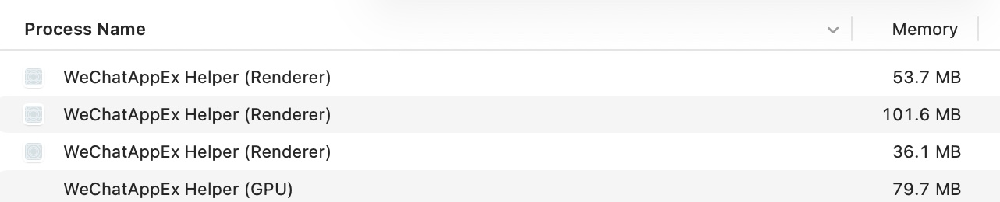
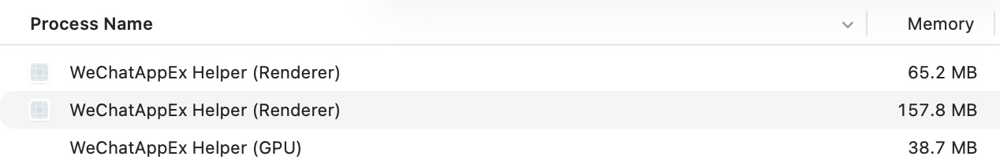
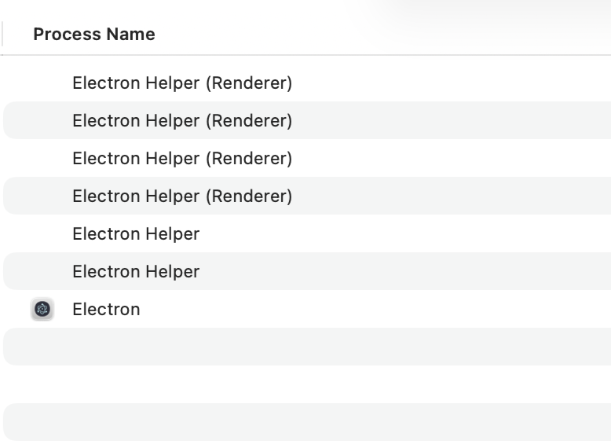
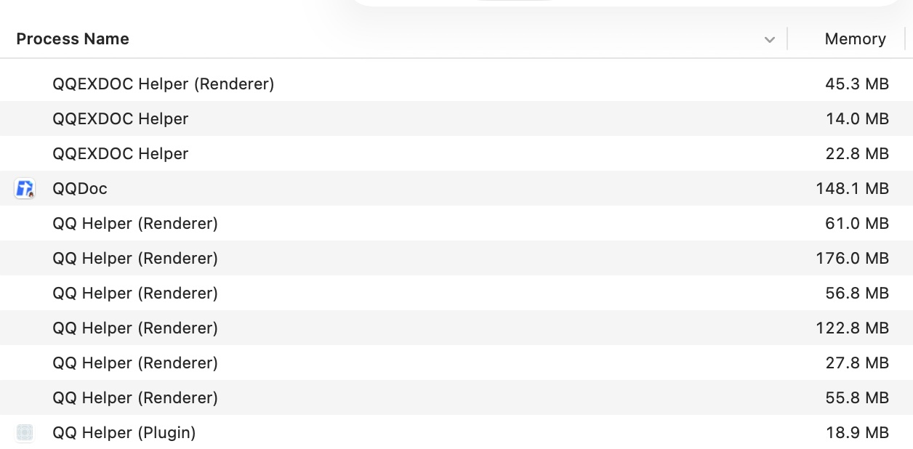
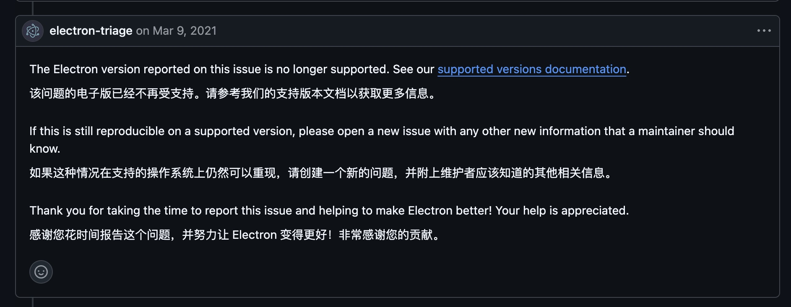
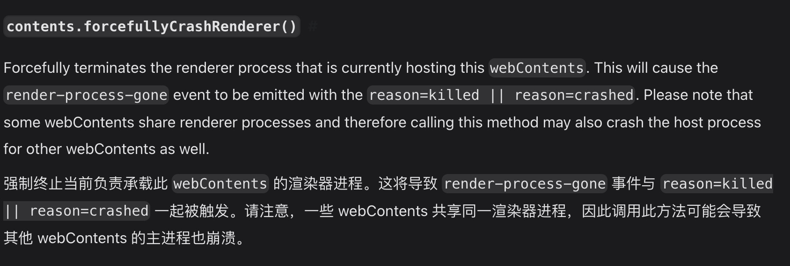

## 灵感来源

这个插件的灵感来源其实很有意思，来源于我一次查看 **Mac 版微信客户端的内存占用**时发现的，如下图：

此时我发现我的微信为什么会有 **三个 Renderer（渲染器）**，所以我试着重启了微信，就看到：

我发现有 **一个 Renderer（渲染器）没了**。为了搞清楚那个渲染器是怎么出现的，我试着打开了我的朋友圈。

当我打开朋友圈的时候我发现它出现了。之后我关掉了我的朋友圈，一个小时后我发现那个 Renderer（渲染器）**一直在那开着，一直占着我 40 多 MB 的内存**！除非重启软件，不然都关不掉。

一开始我以为只是微信有这个问题，结果我打开了 QQ，打开了很多不同的 Electron 应用，甚至自己写了一个最小化测试，结果发现**几乎是所有的 Electron 应用都存在这个问题**！

如下图：

因为现在大多数的 Electron 应用都是配合比如 **React Router、Vue Router** 这些成熟的 Web 框架来使用的，所以在这个情况下就导致了：只要这个 Renderer（渲染器）一直开着，就不会自己关掉；然后如果开得多的话，就会不断地叠加 Renderer（渲染器）。

变成这样：

对于配置不好、或者正在进行别的重要工作的电脑来说，这样的情况还是比较危险的。

所以我就打算写一个插件来负责这个工作！

## 插件的编写

为了写的时候保险一点，我查看了 Electron 在这方面的文档：

很明显，在官方的表述中，官方是非常之肯定 **Renderer（渲染器）在不使用的时候是肯定会被销毁的**。

但是话又说回来了，实际上 Electron 有没有那么做呢？答案是：**没有**。这个问题也并不是今天才被发现，早在 **7 年前的 2019 年**，这个问题就一直存在。

::github{repo="electron/electron/issues/20277"}

然后又过了 5 年，今年 **2026 年**了，最新版的 Electron 还是有这个问题，太草台班子了！

然后在查看文档的过程中，发现了一个应该被注意的细节：

在 Electron 中，**一个 Renderer（渲染器）可能负责多个 Page（页面）的渲染工作**，所以插件必须要注意的是：应该在一个 Renderer（渲染器）**没有任何页面的时候**，使用 Chromium 的任务周期（默认 **15 分钟**）来结束它。（这里是为了兼容性和插件占用最小化，所以直接依赖 Chromium 的任务周期管理）

最终写成了这个插件，并发布到了 [Npmjs](https://www.npmjs.com/package/smart-renderers)。

仓库：

::github{repo="CherryCuteCN/Smart-Renderers"}
