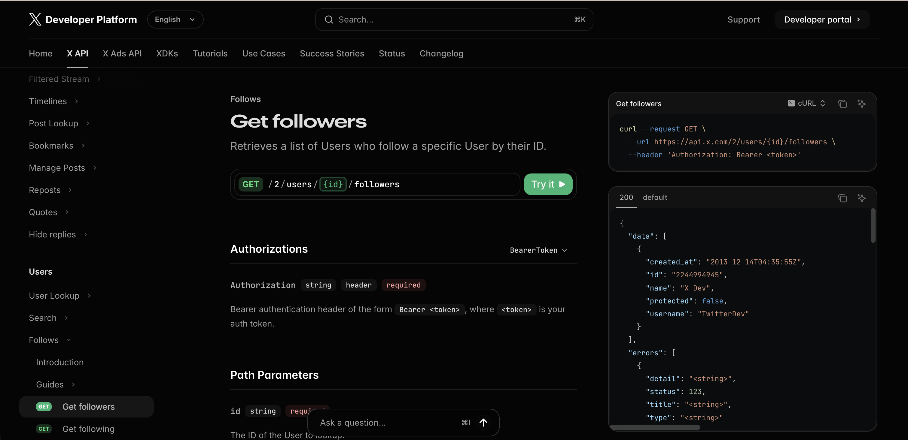
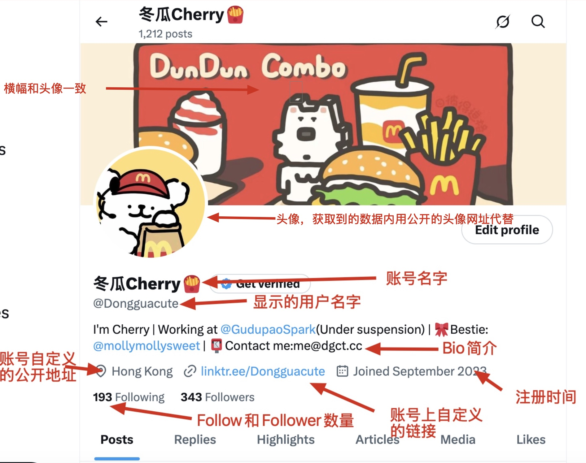

## 事件开始

在当天晚上我在一个同类的群内见到了一位新进入的群友，但是群友的QQ级别很低，在群内的等级也低，所以我**出于安全方面**考虑，对其进行询问，在得到了其X（Twitter）账号，在已经展示出来的follow列表中并没有群主的账号（这里我忘记了X Web获取follow列表只会获取到部分的情况），因为在我的记忆里群主并没有在X等平台上公开本群的二维码，本群也不可以被搜索，所以我产生了怀疑便询问（**对这里的误会我表示抱歉，由于我的疏忽导致了后面的乌龙出现**）。之后她出示了X的follow List和二维码。对于进群这里本来没有什么问题了，从手机界面看来也并非是什么其他设备的截图，到此处我基本没有怀疑了，但是我出于好奇想试试X的API所以我进行了下一步测试（**此处我交流的态度可能不好，也因为我的好奇心导致了后面的误会，对此表示抱歉**）。

## 乌龙的出现

我在获取API之前，**展示了[X的API文档](https://docs.x.com/x-api/users/get-followers)**，我的意图是表示我能获取到的都是公开信息。

之后我通过X的OpenAPI获取到了那位群友的Follow List和Follow List里面那些账号的信息（包括账号在数据库内的id、实际展示id、昵称、头像（包含图片地址，在X的公开图片库中）、横幅包含图片地址（在X的公开图片库中）、Bio（简介）、准确注册时间、Follow数量和Follower数量、账号自定义的地址和网址链接），该信息首先并不涉及任何隐私，没有人可以通过这些来破解使用者的密码和任何其余信息，并且上述信息**除系统内记录的账号唯一id外，其余的都在普通客户端页面内可见**。

示例如下：

## 乌龙的经过

在我将我获取到的账号整理成CSV表格发到群里（我也只发了部分，里面只有账号id和昵称和注册时间），然后就有某些人**自作聪明**认为这是：**“公开搜索他人信息，侵犯他人隐私”**。首先**公开搜索他人的公开信息并不违法**，第二，**我从API获取到的信息都已经是公开信息**，并且你们在页面上也可以看到，**如第二部分展示图片**，**所以并不构成侵犯他人隐私的罪名**。

另外，提出该问题的人，还**在其他群**说**如果将当时的聊天记录提交给我所在地的警方，我会被再次采取强制措施**，对于我上面的阐述，我的行为**并不构成侵犯隐私的罪名**，所以**提出此问题的人**算不算构成**诬告陷害罪（《中华人民共和国刑法》第二百四十三条：捏造事实诬告陷害他人，意图使他人受刑事追究，情节严重的，处三年以下有期徒刑、拘役或者管制；造成严重后果的，处三年以上十年以下有期徒刑。）**和**侵犯个人隐私（《中华人民共和国民法典》第一千零三十二条：任何组织或者个人不得以刺探、泄露、买卖或者非法提供等方式侵犯他人的个人信息。）**。针对她之前说我**再次被采取强制措施**是否**构成侵犯我的隐私**，因为这是我**未公开的私人信息**。

## 总结

我对我因为**疑心过重**导致了本次乌龙事件的发生表示诚挚的抱歉，同时**我也对事件所涉及方面内容并不了解却在胡乱发言的人提出异议**。
